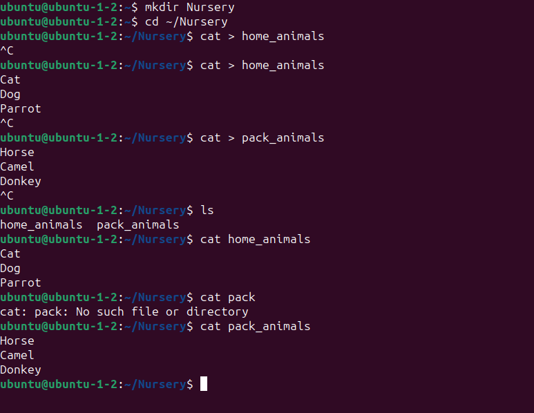
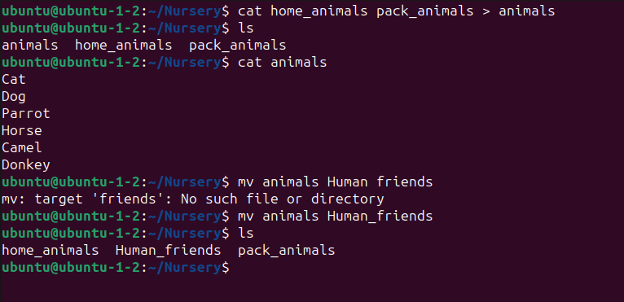
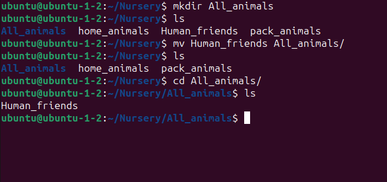
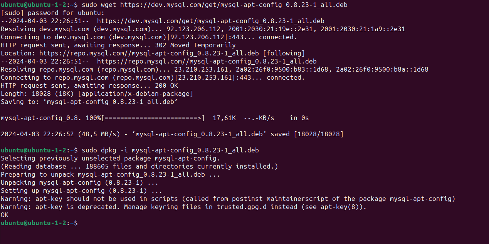
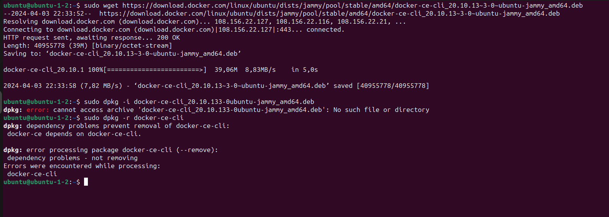
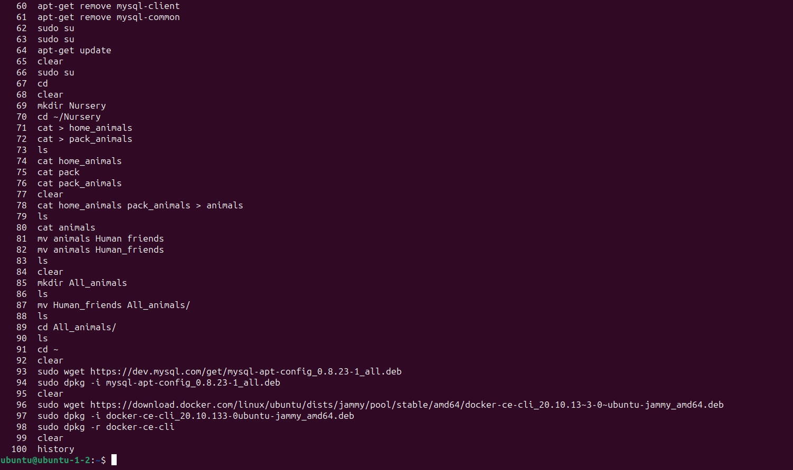
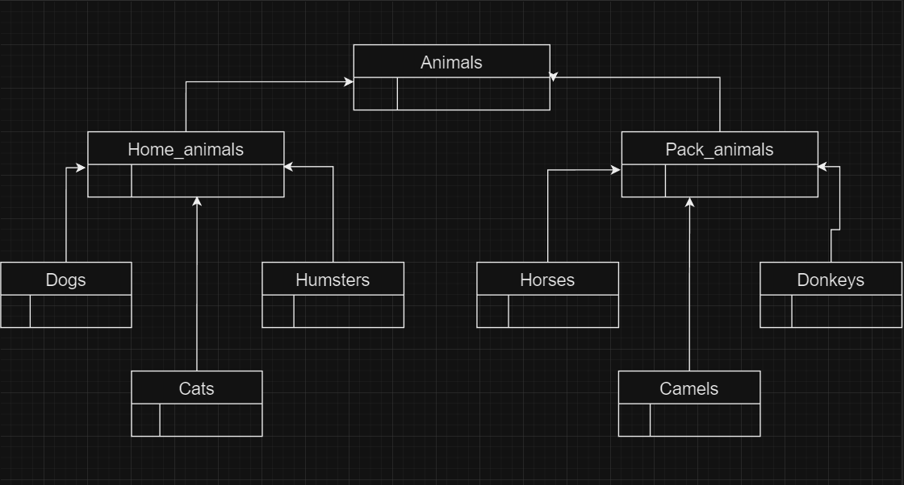

## Задание 1 
Используя команду cat в терминале операционной системы Linux, создать два файла Домашние животные (заполнив файл собаками, кошками, хомяками) и Вьючные животными заполнив файл Лошадьми, верблюдами и ослы, а затем объединить их. Просмотреть содержимое созданного файла. Переименовать файл, дав ему новое имя (Друзья человека).





## Задание 2

Создать директорию, переместить файл туда. 



## Задание 3 

Подключить дополнительный репозиторий MySQL. Установить любой пакет из этого репозитория.



## Задание 4

Установить и удалить deb-пакет с помощью dpkg. 



## Задание 5

Выложить историю команд в терминале ubuntu




## Задание 6 

Нарисовать диаграмму, в которой есть класс родительский класс, домашние
животные и вьючные животные, в составы которых в случае домашних
животных войдут классы: собаки, кошки, хомяки, а в класс вьючные животные
войдут: Лошади, верблюды и ослы.




## Задание 7

В подключенном MySQL репозитории создать базу данных “Друзья
человека”

```sql
CREATE DATABASE Human_friends;
```

## Задание 8

Создать таблицы с иерархией из диаграммы в БД

```sql
USE Human_friends;
CREATE TABLE animal_classes
(
	Id INT AUTO_INCREMENT PRIMARY KEY, 
	Class_name VARCHAR(20)
);

INSERT INTO animal_classes (Class_name)
VALUES ('вьючные'),
('домашние');  


CREATE TABLE packed_animals
(
	  Id INT AUTO_INCREMENT PRIMARY KEY,
    Genus_name VARCHAR (20),
    Class_id INT,
    FOREIGN KEY (Class_id) REFERENCES animal_classes (Id) ON DELETE CASCADE ON UPDATE CASCADE
);

INSERT INTO packed_animals (Genus_name, Class_id)
VALUES ('Лошади', 1),
('Ослы', 1),  
('Верблюды', 1); 
    
CREATE TABLE home_animals
(
	  Id INT AUTO_INCREMENT PRIMARY KEY,
    Genus_name VARCHAR (20),
    Class_id INT,
    FOREIGN KEY (Class_id) REFERENCES animal_classes (Id) ON DELETE CASCADE ON UPDATE CASCADE
);

INSERT INTO home_animals (Genus_name, Class_id)
VALUES ('Кошки', 2),
('Собаки', 2),  
('Хомяки', 2); 

CREATE TABLE cats 
(       
    Id INT AUTO_INCREMENT PRIMARY KEY, 
    Name VARCHAR(20), 
    Birthday DATE,
    Commands VARCHAR(50),
    Genus_id int,
    Foreign KEY (Genus_id) REFERENCES home_animals (Id) ON DELETE CASCADE ON UPDATE CASCADE
);
```

## Задание 9

Заполнить низкоуровневые таблицы именами(животных), командами
которые они выполняют и датами рождения

```sql
INSERT INTO cats (Name, Birthday, Commands, Genus_id)
VALUES ('Персик', '2023-03-20', "Ко мне", 1),
('Дымок', '2022-05-15', "Дымок, сюда", 1),  
('Марго', '2021-08-08', "Дай пять", 1); 

CREATE TABLE dogs 
(       
    Id INT AUTO_INCREMENT PRIMARY KEY, 
    Name VARCHAR(20), 
    Birthday DATE,
    Commands VARCHAR(50),
    Genus_id int,
    Foreign KEY (Genus_id) REFERENCES home_animals (Id) ON DELETE CASCADE ON UPDATE CASCADE
);
INSERT INTO dogs (Name, Birthday, Commands, Genus_id)
VALUES ('Зевс', '2023-08-12', "Рядом!, Сидеть!", 2),
('Аврора', '2023-11-25', "Лежать!, Дай лапу!", 2),  
('Буран', '2024-02-14', "Искать, Фас!", 2);

CREATE TABLE hamsters 
(       
    Id INT AUTO_INCREMENT PRIMARY KEY, 
    Name VARCHAR(20), 
    Birthday DATE,
    Commands VARCHAR(50),
    Genus_id int,
    Foreign KEY (Genus_id) REFERENCES home_animals (Id) ON DELETE CASCADE ON UPDATE CASCADE
);
INSERT INTO hamsters (Name, Birthday, Commands, Genus_id)
VALUES ('Царь', '2023-08-12', "Ко мне", 3),
('Путешественник', '2023-11-25', "На ручки", 3),  
('Мечтатель', '2024-02-14', NULL, 3);

CREATE TABLE horses 
(       
    Id INT AUTO_INCREMENT PRIMARY KEY, 
    Name VARCHAR(20), 
    Birthday DATE,
    Commands VARCHAR(50),
    Genus_id int,
    Foreign KEY (Genus_id) REFERENCES packed_animals (Id) ON DELETE CASCADE ON UPDATE CASCADE
);
INSERT INTO horses (Name, Birthday, Commands, Genus_id)
VALUES ('Гром', '2023-08-12', "Рысью!, Тпру!", 1),
('Ветер', '2023-11-25', "Вперед!, Рядом!", 1),  
('Волна', '2024-02-14', "Галопом!, Стоп!", 1);

CREATE TABLE donkeys 
(       
    Id INT AUTO_INCREMENT PRIMARY KEY, 
    Name VARCHAR(20), 
    Birthday DATE,
    Commands VARCHAR(50),
    Genus_id int,
    Foreign KEY (Genus_id) REFERENCES packed_animals (Id) ON DELETE CASCADE ON UPDATE CASCADE
);
INSERT INTO donkeys (Name, Birthday, Commands, Genus_id)
VALUES ('Лео', '2023-08-12', "Но!", 2),
('Странник', '2023-11-25', "Стоять!", 2),  
('Водопад', '2024-02-14', NULL, 2);

CREATE TABLE camels 
(       
    Id INT AUTO_INCREMENT PRIMARY KEY, 
    Name VARCHAR(20), 
    Birthday DATE,
    Commands VARCHAR(50),
    Genus_id int,
    Foreign KEY (Genus_id) REFERENCES packed_animals (Id) ON DELETE CASCADE ON UPDATE CASCADE
);
INSERT INTO camels (Name, Birthday, Commands, Genus_id)
VALUES ('Сутан', '2023-08-10', NULL, 3),
('Бархан', '2023-03-12', "Лежать!", 3),  
('Мираж', '2024-01-11', "Повернись", 3);
```

## Задание 10

Удалить из таблицы верблюдов, т.к. верблюдов решили перевезти в другой
питомник на зимовку. Объединить таблицы лошади, и ослы в одну таблицу.

```sql
SET SQL_SAFE_UPDATES = 0;
DELETE FROM camels;

SELECT Name, Birthday, Commands FROM horses
UNION SELECT  Name, Birthday, Commands FROM donkeys;
```

## Задание 11

Создать новую таблицу “молодые животные” в которую попадут все
животные старше 1 года, но младше 3 лет и в отдельном столбце с точностью
до месяца подсчитать возраст животных в новой таблице.

```sql
CREATE TEMPORARY TABLE animals AS 
SELECT *, 'Лошади' as genus FROM horses
UNION SELECT *, 'Ослы' AS genus FROM donkeys
UNION SELECT *, 'Собаки' AS genus FROM dogs
UNION SELECT *, 'Кошки' AS genus FROM cats
UNION SELECT *, 'Хомяки' AS genus FROM hamsters;

CREATE TABLE young_animals AS
SELECT Name, Birthday, Commands, genus, TIMESTAMPDIFF(MONTH, Birthday, CURDATE()) AS Age_in_month
FROM animals WHERE Birthday BETWEEN ADDDATE(curdate(), INTERVAL -3 YEAR) AND ADDDATE(CURDATE(), INTERVAL -1 YEAR);
 
SELECT * FROM young_animals;
```

## Задание 12

Объединить все таблицы в одну, при этом сохраняя поля, указывающие на
прошлую принадлежность к старым таблицам.

```sql
SELECT h.Name, h.Birthday, h.Commands, pa.Genus_name, ya.Age_in_month 
FROM horses h
LEFT JOIN young_animals ya ON ya.Name = h.Name
LEFT JOIN packed_animals pa ON pa.Id = h.Genus_id
UNION 
SELECT d.Name, d.Birthday, d.Commands, pa.Genus_name, ya.Age_in_month 
FROM donkeys d 
LEFT JOIN young_animals ya ON ya.Name = d.Name
LEFT JOIN packed_animals pa ON pa.Id = d.Genus_id
UNION
SELECT c.Name, c.Birthday, c.Commands, ha.Genus_name, ya.Age_in_month 
FROM cats c
LEFT JOIN young_animals ya ON ya.Name = c.Name
LEFT JOIN home_animals ha ON ha.Id = c.Genus_id
UNION
SELECT d.Name, d.Birthday, d.Commands, ha.Genus_name, ya.Age_in_month 
FROM dogs d
LEFT JOIN young_animals ya ON ya.Name = d.Name
LEFT JOIN home_animals ha ON ha.Id = d.Genus_id
UNION
SELECT hm.Name, hm.Birthday, hm.Commands, ha.Genus_name, ya.Age_in_month 
FROM hamsters hm
LEFT JOIN young_animals ya ON ya.Name = hm.Name
LEFT JOIN home_animals ha ON ha.Id = hm.Genus_id;
```

## Задание 13

Создать класс с Инкапсуляцией методов и наследованием по диаграмме


